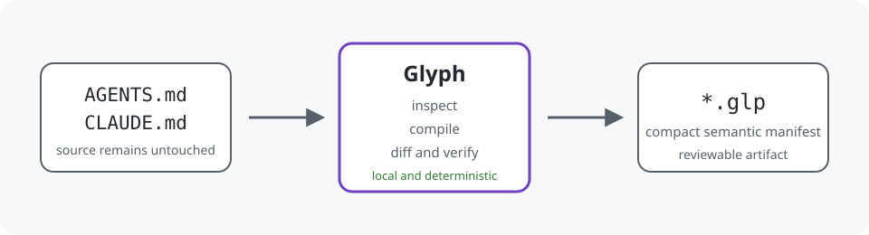

<p align="center">
  
</p>

<h1 align="center">Glyph</h1>

<p align="center">
  Deterministic Instructions-as-Code for coding-agent guidance.
</p>

<p align="center">
  
  
  
  
</p>

Glyph compiles verbose instruction Markdown into compact, measurable `.glp`
semantic manifests. It helps teams inspect, lint, diff, verify, benchmark, lock,
and emit agent guidance without relying on a hosted service or an LLM.

It supports the files teams already use:

```text
AGENTS.md
CLAUDE.md
.github/copilot-instructions.md
.cursorrules
.cursor/rules/*.mdc
README.md
CONTRIBUTING.md
Markdown files below docs/
```

> Glyph preserves measurable operational semantics, not every word or an
> identical agent response. When a directive is important but ambiguous, Glyph
> preserves it for review instead of inventing a policy.

<p align="center">
  
</p>

## Real, inspectable examples

Review a complete source and compiled artifact before installing or adopting Glyph:

| Example | Before | After | Coverage |
| --- | --- | --- | --- |
| [Claude Code service](examples/realistic-claude/README.md) | [`CLAUDE.md`](examples/realistic-claude/CLAUDE.md) | [`CLAUDE.glp`](examples/realistic-claude/CLAUDE.glp) | Python service workflow, safety, verification, and repository-specific guidance |
| [Full-stack monorepo](examples/realistic-agents/README.md) | [`AGENTS.md`](examples/realistic-agents/AGENTS.md) | [`AGENTS.glp`](examples/realistic-agents/AGENTS.glp) | Python and Node tooling, package boundaries, generated files, migrations, and approvals |

These are maintained realistic fixtures compiled into separate deterministic artifacts. The source files remain untouched. Each example includes commands for `inspect`, `compile`, `diff`, and `verify`, so the committed output can be audited and reproduced. See the [examples index](examples/README.md).

## Use Glyph from Codex or Claude Code

This repository ships a reusable [Glyph agent skill](skills/glyph/SKILL.md). The
skill teaches coding agents to inspect instruction files before compilation,
keep the source untouched, explain anything preserved or unmapped, generate a
separate `.glp` artifact, and verify the result.

The skill orchestrates the local Glyph CLI. It does not add LLM interpretation
to the compiler, install software silently, or overwrite `AGENTS.md`,
`CLAUDE.md`, or another instruction source.

Install the Glyph executable first:

```bash
python -m pip install "glyph-instructions @ git+https://github.com/francescogabrieli/glyph.git@v0.2.0"
```

### Codex

Install the skill from its GitHub directory with the Codex skill installer:

```text
$skill-installer install https://github.com/francescogabrieli/glyph/tree/main/skills/glyph
```

Restart Codex after installation, then ask:

```text
Use the Glyph skill to inspect AGENTS.md, explain anything unmapped, compile it
to a separate AGENTS.glp file, and verify the result.
```

The repository also includes a skill-only Codex plugin manifest at
[`.codex-plugin/plugin.json`](.codex-plugin/plugin.json).

### Claude Code

Register the repository as a marketplace and install the plugin:

```text
/plugin marketplace add francescogabrieli/glyph
/plugin install glyph@glyph-marketplace
```

Then ask:

```text
Use the Glyph skill to audit CLAUDE.md before compiling it. Keep the source
untouched and explain anything preserved or unmapped.
```

Read the complete [skill installation and usage guide](skills/README.md).

## Why Glyph

Instruction files tend to combine commands, safety requirements, workflow,
repository conventions, product documentation, examples, and prose. That makes
them costly to load and hard to review mechanically.

Glyph provides a local semantic layer:

| Need | Glyph capability |
| --- | --- |
| Compact instruction context | Versioned, readable `.glp` manifests and three rendering profiles. |
| Safe extraction | Canonical rules, structured 0.2 policies, and a source-faithful `preserve` fallback. |
| Reviewable change | Semantic diff, provenance, conflict detection, and content-derived IDs. |
| CI enforcement | Strict compilation, retention/safety metrics, semantic locks, and freshness checks. |
| Existing agent tools | Markdown emitters for AGENTS, Claude, Copilot, Cursor, and generic Markdown. |
| Focused context | Deterministic task-aware selection with mandatory safety instructions. |

## Quickstart

Glyph 0.2.0 is distributed through its tagged GitHub Release. PyPI
distribution is planned; until then, install the immutable release tag:

```bash
pip install "glyph-instructions @ git+https://github.com/francescogabrieli/glyph.git@v0.2.0"

glyph inspect AGENTS.md --show-unmapped
glyph compile AGENTS.md -o AGENTS.glp --report glyph-report.md
glyph stats AGENTS.md AGENTS.glp
glyph verify AGENTS.md AGENTS.glp
```

Create a project starter, including configuration and a lockfile:

```bash
glyph init --from AGENTS.md
```

Use strict checks only after reviewing your baseline:

```bash
glyph compile AGENTS.md -o AGENTS.glp \
  --strict \
  --min-structured-coverage 80 \
  --min-retained-coverage 100 \
  --max-high-risk-preserved 0

glyph check AGENTS.md AGENTS.glp \
  --min-structured-coverage 80 \
  --min-retained-coverage 100 \
  --max-high-risk-preserved 0 \
  --min-reduction 20
```

Read the full [Getting started guide](docs/getting-started.md) before adopting
Glyph in CI.

## A small example

Source Markdown:

```md
Read the relevant files before editing.
Create a short plan before non-trivial changes.
Run the test suite before considering work complete.
Never commit secrets, tokens, API keys, or credentials.
Ask before destructive operations.
```

Canonical `.glp` output:

```text
glyph/0.1

flow[read,plan,test]

must[
  plan_before_edit
  read_before_edit
  run_tests_before_done
]

deny[secrets_commit]
ask[destructive_ops]
```

Not all source text has a reusable canonical ID. `.glp 0.2` adds a small
structured policy language for cases that need an explicit subject, predicate,
object, condition, exception, or inseparable relationship:

```text
atomic | all(...) | any(...) | not(...)
```

The format is intentionally conservative. See the
[`.glp 0.2` architecture](docs/glp-0.2-policy-architecture.md).

## Core workflows

### Inspect before changing meaning

```bash
glyph inspect AGENTS.md --show-unmapped
glyph lint AGENTS.md
glyph score AGENTS.md
glyph diff previous.AGENTS.glp AGENTS.glp
```

### Keep Markdown compatibility

```bash
glyph emit AGENTS.glp --target agents-md -o AGENTS.generated.md
glyph emit AGENTS.glp --target claude-md -o CLAUDE.md
glyph emit AGENTS.glp --target copilot -o .github/copilot-instructions.md
glyph emit AGENTS.glp --target cursor -o .cursor/rules/glyph.mdc
```

Generated Markdown preserves the semantics encoded in the manifest, not the
original prose layout. Read [Compatibility](docs/compatibility.md).

### Encode a local convention

```bash
glyph rules suggest AGENTS.md --format yaml
glyph compile AGENTS.md -o AGENTS.glp --rules glyph.rules.yml
```

Review generated suggestions. Use a custom semantic rule for stable reusable
meaning, and an exact 0.2 custom policy only for a single approved
repository-specific interpretation. Read [Custom rules](docs/custom-rules.md).

### Select instructions for a task

```bash
glyph select AGENTS.glp --task "fix failing tests" --format markdown
glyph select AGENTS.glp --task "add database migration" --max-tokens 300
```

Selection is local and rule-based. Safety and approval instructions remain
mandatory when relevant.

## What Glyph measures

Glyph reports distinct metrics so token savings are never mistaken for semantic
retention:

| Metric | Meaning |
| --- | --- |
| Token reduction | `1 - glp_tokens / markdown_tokens`; can be negative for very small inputs. |
| Structured coverage | Operational candidates represented by canonical rules or structured policies. |
| Retained coverage | Structured candidates plus source-faithful preserved directives. |
| Safety retention | Retained coverage for high-risk operational candidates. |
| Preserved / dropped | Review counts for unresolved and genuinely failed candidate handling. |

The current fixed external static corpus result is **78.65% structured
coverage**, **100% retained coverage**, **100% safety retention**, **0
high-risk preserved directives**, **0 dropped candidates**, and **0
nondeterminism failures** across 124 supported files from 10 pinned
repositories. This is reproducible evidence for that corpus, not a universal
claim about every repository or agent runtime. See the
[static-gate report](docs/release-candidate-v0.2-static-gate-report.md).

## Documentation

Start with the [documentation hub](docs/README.md).

| If you need to… | Read… |
| --- | --- |
| install, compile, and check one file | [Getting started](docs/getting-started.md) |
| understand every command | [CLI reference](docs/cli-reference.md) |
| roll out Glyph incrementally | [Adoption guide](docs/adoption-guide.md) |
| edit `.glp` directly | [Specification](docs/glp-spec.md) |
| configure defaults or CI | [Configuration](docs/configuration.md) and [CI guide](docs/ci-cd.md) |
| add repository semantics | [Custom rules](docs/custom-rules.md) |
| understand preservation and strict mode | [No silent semantic loss](docs/no-silent-semantic-loss.md) |
| troubleshoot a command or metric | [Troubleshooting](docs/troubleshooting.md) |
| contribute or release Glyph | [Contributing](CONTRIBUTING.md) and [Release process](docs/release-process.md) |
| evaluate agent-runtime behavior separately | [Behavior evaluation](docs/behavior-evaluation.md) |
| propose native agent support | [Native agent support](docs/native-agent-support.md) and [maintainer proposal](docs/agent-maintainer-proposal.md) |
| read the formal v0.1 grammar | [v0.1 specification](spec/glp-0.1.md) |

## Development

```bash
pip install -e ".[dev]"
pytest
ruff check .
mypy
glyph benchmark benchmarks/
python -m build
bash scripts/release-smoke.sh
```

The complete contributor workflow is in [Development guide](docs/development.md)
and [Testing guide](docs/testing.md).

## Scope and non-claims

- Glyph does not call an LLM or remote API.
- Glyph does not claim to preserve arbitrary Markdown or guarantee identical
  coding-agent behavior.
- Glyph does not silently flatten `.glp 0.2` semantics into a lossy v0.1 form.
- Glyph does not require native `.glp` support from any agent runtime; Markdown
  emitters support progressive adoption.

See [FAQ](docs/faq.md), [Security model](docs/security-model.md), and
[Roadmap](docs/roadmap.md) for the full boundaries.

## Contributing and support

Contributions are welcome. Read [CONTRIBUTING.md](CONTRIBUTING.md),
[CODE_OF_CONDUCT.md](CODE_OF_CONDUCT.md), [SUPPORT.md](SUPPORT.md), and
[SECURITY.md](SECURITY.md) before opening an issue or pull request.

## License

MIT. See [LICENSE](LICENSE).
